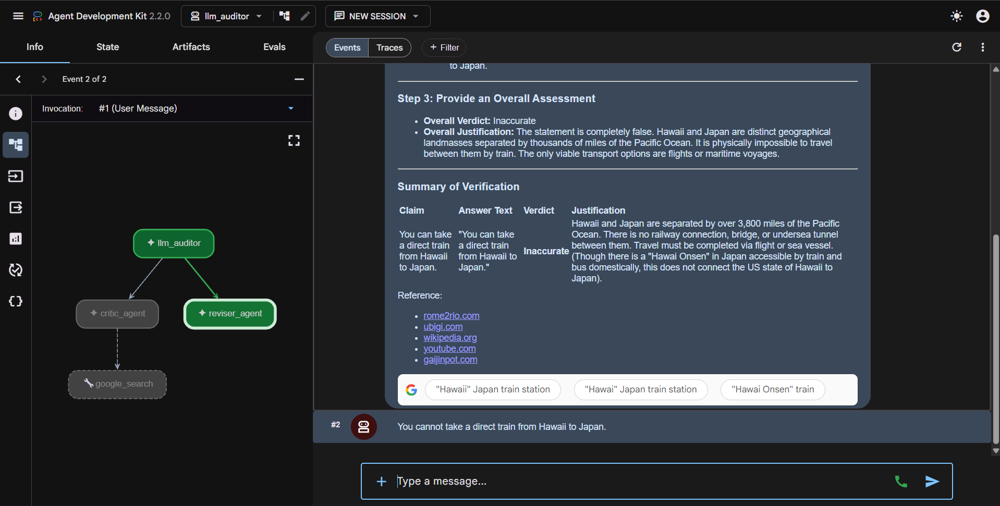

Welcome to Google Cloud Shell, a tool for managing resources hosted on Google Cloud Platform!
The machine comes pre-installed with the Google Cloud SDK and other popular developer tools.

# Cymbal Travel Agent Framework (ADK)

An automated AI travel assistant suite built with Google's **Agent Development Kit (ADK)** and backed by the Vertex AI **Gemini** platform models.

## Technology Stack & Badges
[](https://cloud.google.com/)
[](https://deepmind.google/technologies/gemini/)
[](https://github.com/google/adk)
[](https://adk.dev)

---

## Application UI Preview


## Integrated Documentation Matrix

* **Google Search Grounding Service:** Documentation on [ADK Google Search Integrations](https://adk.dev/integrations/google-search/)
* **Core Agent Framework:** For onboarding tutorials, visit the [Agent Development Kit Portal](https://adk.dev/)

---

## Configuration Requirements (`.env`)

To interface with the Vertex AI Agent Platform correctly, every active agent microservice module relies on a local `.env` runtime matrix. 

Create a `.env` file in the root directory (and sync copies to `my_google_search_agent/`, `geo_validator/`, and `llm_auditor/`) containing the following exact block format:

```env
# Enforces enterprise routing through the Vertex AI Generative SDK
GOOGLE_GENAI_USE_ENTERPRISE=true

# Your target Google Cloud Platform project identifier
GOOGLE_CLOUD_PROJECT=qwiklabs-gcp-01-be82a96d44a6

# Regional gateway host for model deployment (Must be global for global preview models)
GOOGLE_CLOUD_LOCATION=global

# The explicit model version utilized by the execution engine
MODEL=gemini-3.5-flash
⚠️ Important: Do not hardcode raw personal API keys directly inside the application workspace. Authentication must run strictly through application-default platform credentials using the gcloud auth application-default login flow.

Component Layout
my_google_search_agent: Travel Scout that leverages web searches to find live, local event tracking and exchange updates.

geo_validator: Strict, schema-enforced country location analyzer using Pydantic models.

llm_auditor: Complex, sequential multi-agent orchestration pipeline passing tokens dynamically from a Critic agent to a Reviser agent for auto-correction workflows.
